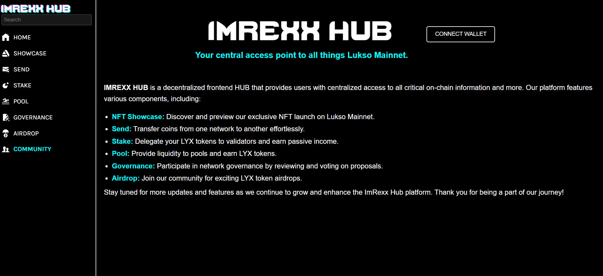
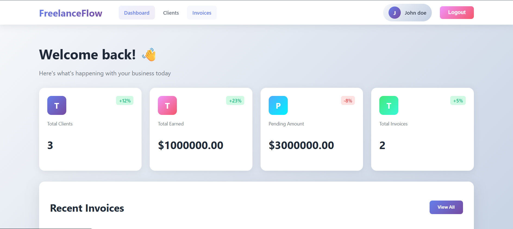
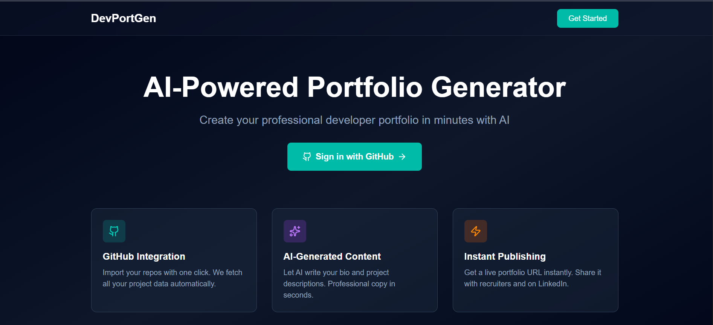

<!DOCTYPE html>
<html lang="en">
  <head>
    <meta charset="UTF-8" />
    <meta name="viewport" content="width=device-width, initial-scale=1.0" />
    <link rel="shortcut icon" type="image/png" href="./images/favicon.png" />
    <title>
      Imran Damare | A Full-Stack Engineer based in Abuja, Nigeria
    </title>

    <meta name="description" content="Imran Damare - Full-Stack Engineer based in Abuja, Nigeria. Building AI-powered web applications with Next.js, React, and PostgreSQL.">
    <meta name="keywords" content="Imran Damare, Full-Stack Engineer, Next.js, React, TypeScript, PostgreSQL, Web3" />
    <link rel="stylesheet" href="index.css" />
  </head>

<body>

  <!-- ***** Header ***** -->

  <header class="header" role="banner" id="top">
    

      <nav class="nav" role="navigation">
        <ul class="nav__items">
          <li class="nav__item"><a href="#work" class="nav__link">Work</a></li>
          <!-- <li class="nav__item"><a href="#clients" class="nav__link">Clients</a></li> -->
          <li class="nav__item">
            <a href="#about" class="nav__link">About</a>
          </li>
          <li class="nav__item">
            <a href="#clients" class="nav__link">Skillsets</a>
          </li>
          <li class="nav__item">
            <a href="#contact" class="nav__link">Contact</a>
          </li>
        </ul>
      </nav>
    

    

      

        <h1 class="heading-primary">
          Imran Damare
        </h1>
        
A Full-Stack Engineer based in Abuja, Nigeria

        <a href="#contact" class="btn btn--pink">Get in touch</a>
      

    

  </header>

  <main role="main">

    <!-- ***** Work ***** -->

    <section class="work" id="work">
      

        <h2>My Work</h2>
        

          <!-- Each div with the work__box class is a project. -->

          

            

              <h3>Crypto Hub</h3>
              

                Imrexx Hub is a central access point that gives you access to different functionalities on Lukso network.
              

              <ul class="work__list">
                <li>VITE</li>
                <li>Ether.js</li>
                <li>JavaScript</li>
                <li>React.js</li>
              </ul>

              

                <a href="https://imrexx-hub.vercel.app/" rel="noopener" target="_blank" class="link__text">
                  Visit Site &rarr;
                </a>
                
              

            

            

              
            

          

          

            

              <h3>freelanceflow</h3>
              

                A full-stack invoicing and client management app for freelancers. It offers features that handles authentication, clients, invoices, analytics, and payments.
              

              <ul class="work__list">
                <li>React.js</li>
                <li>Axios</li>
                <li>Express.js</li>
                <li>PostgreSQL</li>
              </ul>

              

                <a href="https://freelanceflow-frontend.vercel.app/dashboard" class="link__text">
                  Visit Site &rarr;
                </a>
                
              

            

            

              
            

          

          

            

              <h3>DevPortGen</h3>
              

                A full-stack AI-powered portfolio generator for developers. Features includes GitHub OAuth, GitHub API integration, AI-generated bios, and instant portfolio publishing.
              

              <ul class="work__list">
                <li>Next.js 14</li>
                <li>TypeScript</li>
                <li>GitHub REST API</li>
                <li>PostgreSQL</li>
              </ul>

              

                <a href="https://dev-port-gen.vercel.app/" rel="noopener" target="_blank" class="link__text">
                  Visit Site &rarr;
                </a>
                
              

            

            

              
            

          

        

      

    </section>

    <!-- ***** Skillsets ***** -->
    
    <section class="client" id="clients">
      

        <h2>My Skillsets</h2>
        
I bring a diverse set of skills to my work, combining a passion for efficient and well-structured web development with a focus on intuitive UI design. My core abilities include writing JavaScript (ES6+) and working with powerful frameworks like React and Next.js 14 (App Router) for building complex, production-ready UIs. I work with TypeScript for type-safe codebases, Tailwind CSS for rapid UI development, and Node.js for backend logic. On the database side, I design schemas and work with PostgreSQL via Prisma ORM, with hands-on experience deploying to cloud databases like Neon. I implement secure authentication systems using NextAuth.js with OAuth providers, integrate third-party APIs including GitHub REST API and Claude AI and deploy full-stack applications to Vercel. My development workflow includes Git version control, environment configuration, and building multi-step forms with React Hook Form and Zod validation. 

      

    </section> 

    <!-- ***** About ***** -->

    <section class="about" id="about">
      

        <h2>About Me</h2>
        

          

            
I'm a web developer and designer based in Abuja, Nigeria. I love building apps that solve real-world problems, and that are delightful to use. My specialities include Next.js, React, TypeScript, and PostgreSQL from database design to deployed product.

            
My background is in Information and Communication Technology, and I have a bachelors degree in Computer Science from University of Abuja. I also have 3 adorable cats.

            <!-- Provide a link to your resume -->
            <!-- <a href="#" class="btn">My Resume</a> -->
          

          

            
          

        

      

    </section>
  </main>

  <!-- ***** Contact ***** -->

  <section class="contact" id="contact">
    

      <h2>Get in Touch</h2>
      

        

          Are you looking for a fast-performing and user-friendly website to represent your product or business? or looking for any kind of consultation? or want to ask questions? or have some advice for me or just want to say "Hi 👋" in any case feel free to Let me know. I will do my best to respond back. 😊 The quickest way to reach out to me is via an email.
        

        <a href="mailto:imrexxx93@gmail.com" class="btn">imrexxx93@gmail.com</a>
      

    

  </section>

  <!-- ***** Footer ***** -->

  <footer role="contentinfo" class="footer">
    

      <!-- Update the links to point to your accounts -->
      <ul class="footer__social-links">
        <li class="footer__social-link-item">
          
        </li>
        <li class="footer__social-link-item">
          
        </li>
        <!-- <li class="footer__social-link-item">
          
        </li> -->
        <li class="footer__social-link-item">
          
        </li>
      </ul>
    

  </footer>

  
   
</body>

</html>

// CSS //

/* --------------------------------------- */
/* ----- Basic Setup ----- */
/* --------------------------------------- */

@font-face {
    font-family: 'Hk Grotesk';
    font-style: normal;
    font-weight: 400;
    src: url('./fonts/HKGrotesk-Regular.woff') format('woff');
}

@font-face {
    font-family: 'Jost';
    font-style: normal;
    font-weight: 400;
    src: url('./fonts/Jost-Regular.ttf') format('woff');
}

* {
    margin: 0;
    padding: 0;
    box-sizing: inherit;
}

:root {
    --font-size-small: 1.8rem;
    --font-size-normal: 2.2rem;
    --font-size-medium: 2.8rem;
    --font-size-medium-1: 3.6rem;
    --font-size-large: 5.5rem;
    --font-size-huge: 7.5rem;
    --font-stack: 'Hk Grotesk', sans-serif;

    --line-height-normal: 1.7;
    --line-height-small: 1.2;

    --black: #000;
    --pink: #353e43;
    --white: #f0e9f2;
    --white-1: #e5e5e6da;

    --container-max-width: 1180px;
    --container-normal-width: 800px;
    --container-medium-width: 700px; 
    --container-small-width: 500px;

    --gutter-huge: 12rem;
    --gutter-medium: 6rem;
    --gutter-normal: 3rem;
    --gutter-small-1: 2.5rem;
    --gutter-small: 2rem;
    --gutter-x-small: 1rem;
    --border-light: 1px solid rgb(36, 35, 35);
}

html {
    font-size: 62.5%; /* (16/10)*100 = 62.5% => 1rem = 10px */
    box-sizing: border-box;
    scroll-behavior: smooth;
}

@media(max-width: 1000px) {
    html {
        font-size: 52%;
    }
}

body {
    font-size: var(--font-size-small);
    font-family: var(--font-stack);
    font-weight: 400;
    color: var(--white-1);
    line-height: var(--line-height-normal);
    background: var(--black);
    overflow-x: hidden;
}

.row {
    max-width: var(--container-max-width);
    margin: 0 auto;
}

@media(max-width: 1340px) {
    .row {
        max-width: 1100px;
    }
}

@media(max-width: 1240px) {
    .row {
        padding: 0 var(--gutter-medium);
    }
}

@media(max-width: 600px) {
    .row {
        padding: 0 var(--gutter-normal);
    }
}

@media(max-width: 600px) {
    .row {
        padding: 0 var(--gutter-small);
    }
}

section {
    padding: var(--gutter-huge) 0;
    border-bottom: var(--border-light);
}

img {
    object-fit: contain;
    max-width: 100%;
}

/* --------------------------------------- */
/* ----- Headlines and Paragraphs ----- */
/* --------------------------------------- */

h1,
h2,
h3 {
    font-family: 'Jost', sans-serif;
    font-weight: 400;
    line-height: var(--line-height-small);
    color: var(--white);
}

.heading-primary {
    line-height: 1;
    font-size: var(--font-size-huge);
    font-weight: 400;
}

@media(max-width: 900px) {
    .heading-primary {
        font-size: 6.5rem;
    }
}

h2 {
    font-size: var(--font-size-large);
    margin-bottom: var(--gutter-medium);
}

h2::after {
    content: '';
    display: block;
    height: 2px;
    width: 10rem;
    background: var(--pink);
    margin: var(--gutter-small) 0;
}

h3 {
    font-size: var(--font-size-medium-1);
    margin-bottom: var(--gutter-small);
}

@media(max-width: 500px) {
    .heading-primary {
        font-size: var(--font-size-large);
    }

    h2 {
        font-size: var(--font-size-medium-1);
    }

    h3 {
        font-size: var(--font-size-medium);
    }
}

p {
    margin: var(--gutter-small) 0;
}

@media(max-width: 900px) {
    p { 
        max-width: var(--container-small-width);
    }
}

/* --------------------------------------- */
/* ----- Buttons and Links ----- */
/* --------------------------------------- */

a {
    color: var(--white);
    font-weight: 400;
    font-family: 'Jost', sans-serif;
    transition: all .2s;
    outline: 2px solid transparent;
}

::-moz-focus-inner {
    border: 0;
}

button:focus,
a:focus {
    outline: 2px solid var(--pink);
}

body:not(.user-is-tabbing) button:focus,
body:not(.user-is-tabbing) a:focus {
    outline: none;
}

.link:hover {
    color: var(--pink);
}

.btn {
    position: relative;
    display: inline-block;
    padding: 1rem 4.2rem;
    text-decoration: none;
    color: inherit;
    border: 1px solid  var(--pink);
    font-weight: 400;
}

.btn:focus {
    outline: none;
}

.btn::after {
    content: '';
    display: block;
    position: absolute;
    top: 0;
    left: 0;
    right: 100%;
    background: var(--white);
    height: 100%;
    z-index: -1;
    transition: all 0.2s cubic-bezier(1, 0.68, 0.16, 0.9);
}

.btn:hover::after,
.btn:focus::after {
    right: 0;
    background: var(--pink);
}

.btn--pink {
    background: var(--pink);
    transition: all 0.2s;
}

.btn--pink::after {
    display: none;
}

.btn--pink:hover,
.btn--pink:focus {
    background: transparent;
}

.link__text {
    position: relative;
    display: inline-block;
    padding: .6rem;
    color: inherit;
    text-decoration: none;
    border-bottom: 1px solid var(--pink);
}

.link__text::after {
    content: '';
    display: block;
    position: absolute;
    top: 0;
    left: 0;
    right: 100%;
    background: var(--white);
    height: 100%;
    z-index: -1;
    transition: all 0.2s cubic-bezier(1, 0.68, 0.16, 0.9);
}

.link__text:focus {
    outline: none;
}

.link__text:hover::after,
.link__text:focus:after {
    right: 0;
    background: var(--pink);
}

.link__text span {
    padding-left: 1rem;
    font-family: sans-serif;
}

/* ----- Back to Top ----- */

.back-to-top {
    position: fixed;
    bottom: 4rem;
    right: 4rem;
    display: flex;
    justify-content: center;
    align-items: center;
    height: 5.5rem;
    width: 5.5rem;
    background-color: var(--pink);
    border-radius: 50%;
    z-index: 10;
    visibility: hidden;
    transition: all .4s;
}

.back-to-top__image {
    height: 70%;
}

@media(max-width: 900px) {
    .back-to-top {
        right: 2rem;
    }
}

@media(max-width: 500px) {
    .back-to-top {
        right: 1rem;
    }
}

/* --------------------------------------- */
/* ----- Navigation ----- */
/* --------------------------------------- */

.nav {
    display: flex;
    justify-content: flex-end;
    padding: var(--gutter-normal) 0;
}

.nav__items {
    display: flex;
    list-style: none;
}

.nav__item:not(:last-child) {
    margin-right: var(--gutter-medium);
}

@media(max-width: 500px) {
    .nav {
        justify-content: center;
    }
}

@media(max-width: 400px) {
    .nav__item:not(:last-child) {
        margin-right: var(--gutter-normal);
    }
}

@media(max-width: 300px) {
    .nav {
        font-size: var(--font-size-small);
    }
}

.nav__link {
    position: relative;
    display: inline-block;
    padding: 1rem 0;
    text-decoration: none;
    color: inherit;
    transition: all .2s;
}

.nav__link::after {
    content: '';
    position: absolute;
    bottom: 0;
    left: 0;
    right: 100%;
    display: inline-block;
    height: 1rem;
    background: var(--white);
    transition: all 0.25s cubic-bezier(1, 0.68, 0.16, 0.9);
}

.nav__link:hover {
    color: var(--pink);
}

.nav__link:hover::after {
    right: 0;
    height: 2px;
    background: var(--pink);
}

/* --------------------------------------- */
/* ----- Header ----- */
/* --------------------------------------- */

.header {
    background: linear-gradient(rgba(0,0,0, .1), rgba(0,0,0, .4)), 
        url('./images/header.jpg');
    height: 100vh;
    background-size: cover;
    background-position: center;
    background-attachment: fixed;
    font-size: var(--font-size-normal);
}

.header__text {
    position: absolute;
    top: 50%;
    transform: translateY(-50%);
}

.header__text p {
    margin: 1.5rem 0 3.5rem;
    max-width: var(--container-medium-width);
    font-family: 'Jost', sans-serif;
    font-size: var(--font-size-medium);
}

@media(max-width: 500px) {
    .header {
        text-align: center;
    }

    .header__text p {
        transform: scale(.8);
    }
}

/* --------------------------------------- */
/* ----- Work ----- */
/* --------------------------------------- */

.work__box {
    display: flex;
    align-items: center;
}

@media(max-width: 900px) {
    .work__box {
        align-items: initial;
        flex-direction: column-reverse;
    }
}

.work__box:not(:last-child) {
    margin-bottom: 15rem;
}

@media(max-width: 500px) {
    .work__box:not(:last-child) {
        margin-bottom: 10rem;
    }
}

.work__links {
    display: flex;
    align-items: center;
}

.work__text {
    flex: 0 0 30%;
}

.work__list {
    /* list-style-type: square; */
    list-style-position: inside;
    margin-bottom: var(--gutter-normal);
}

.work__code {
    display: block;
    height: 3rem;
    margin-left: var(--gutter-normal);
    transition: all .3s;
}

.work__code:hover {
    transform: scale(1.2);
}

.work__image-box {
    margin-bottom: var(--gutter-normal);
}

@media(min-width: 901px) {
    .work__image-box {
        flex: 1;
        margin: 0 0 0 10rem;
    }
}

@media(max-width: 900px) {
    .work__code {
        height: 4rem;
    }
}

/* --------------------------------------- */
/* ----- Clients ----- */
/* --------------------------------------- */

.client__logos {
    display: flex;
    justify-content: space-between;
    filter: invert(100%) grayscale(100%) opacity(.8);
}

.client__logo {
    height: 6.5rem;
    max-width: 18rem;
}

@media(max-width: 1240px) {
    .client__logos {
        overflow-x: scroll;
        padding: var(--gutter-normal);
    }

    .client__logo:not(:last-of-type) {
        margin-right: var(--gutter-medium);
    }
}

/* --------------------------------------- */
/* ----- About ----- */
/* --------------------------------------- */

.about__content {
    display: flex;
    flex-direction: row-reverse;
    align-items: center;
}

@media(max-width: 900px) {
    .about__content {
        flex-direction: column-reverse;
        align-items: initial;
    }
}

.about__photo-container {
    margin-bottom: var(--gutter-normal);
}

@media(min-width: 901px) {
    .about__text {
        flex: 0 0 35%;
    }
    
    .about__photo-container {
        flex: 1;
        margin: 0 var(--gutter-huge) 0 0;
    }
}

/* --------------------------------------- */
/* ----- Contact ----- */
/* --------------------------------------- */

.contact__info {
    max-width: var(--container-medium-width);
}

/* --------------------------------------- */
/* ----- Footer ----- */
/* --------------------------------------- */

.footer {
    text-align: center;
    padding: var(--gutter-medium) 0 var(--gutter-normal);
}

.footer__social-links {
    display: flex;
    justify-content: center;
    padding: var(--gutter-normal) 0;
    list-style: none;
}

.footer__social-link-item:not(:last-of-type) {
    margin-right: var(--gutter-small);
}

.footer__social-image {
    height: 4rem;
}

.footer__github-buttons {
    display: flex;
    justify-content: center;
}

.footer__github-buttons iframe {
    height: 2.5rem;
    width: 84px;
    transform: translateY(3px);
}

@media(max-width: 500px) {
    .footer {
        padding: var(--gutter-medium) 0;
    } 
}

// JS // 

/* -----------------------------------------
  Have focus outline only for keyboard users 
 ---------------------------------------- */

const handleFirstTab = (e) => {
  if(e.key === 'Tab') {
    document.body.classList.add('user-is-tabbing')

    window.removeEventListener('keydown', handleFirstTab)
    window.addEventListener('mousedown', handleMouseDownOnce)
  }

}

const handleMouseDownOnce = () => {
  document.body.classList.remove('user-is-tabbing')

  window.removeEventListener('mousedown', handleMouseDownOnce)
  window.addEventListener('keydown', handleFirstTab)
}

window.addEventListener('keydown', handleFirstTab)

const backToTopButton = document.querySelector(".back-to-top");
let isBackToTopRendered = false;

let alterStyles = (isBackToTopRendered) => {
  backToTopButton.style.visibility = isBackToTopRendered ? "visible" : "hidden";
  backToTopButton.style.opacity = isBackToTopRendered ? 1 : 0;
  backToTopButton.style.transform = isBackToTopRendered
    ? "scale(1)"
    : "scale(0)";
};

window.addEventListener("scroll", () => {
  if (window.scrollY > 700) {
    isBackToTopRendered = true;
    alterStyles(isBackToTopRendered);
  } else {
    isBackToTopRendered = false;
    alterStyles(isBackToTopRendered);
  }
});
